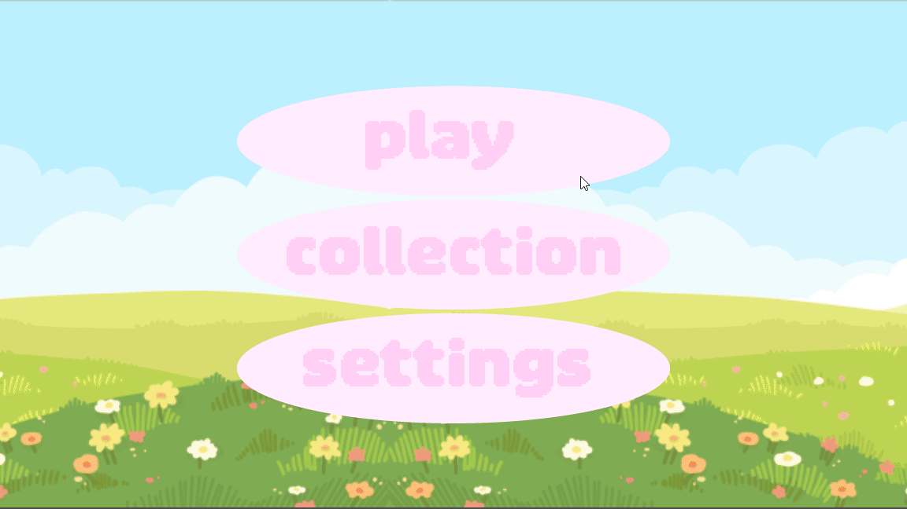

<!-- Improved compatibility of back to top link: See: https://github.com/iPanja/gd_bunnies/pull/73 -->
<a name="readme-top"></a>


<!-- PROJECT SHIELDS -->
<!--
*** I'm using markdown "reference style" links for readability.
*** Reference links are enclosed in brackets [ ] instead of parentheses ( ).
*** See the bottom of this document for the declaration of the reference variables
*** for contributors-url, forks-url, etc. This is an optional, concise syntax you may use.
*** https://www.markdownguide.org/basic-syntax/#reference-style-links
-->
[![MIT License][license-shield]][license-url]
[![LinkedIn][linkedin-shield]][linkedin-url]


<!-- PROJECT LOGO -->
<br />
<div align="center">
  <a href="https://github.com/iPanja/gd_bunnies">
    
  </a>

  <h3 align="center">Bunny Puzzle Game</h3>
</div>


<!-- TABLE OF CONTENTS -->
<details>
  <summary>Table of Contents</summary>
  <ol>
    <li>
      <a href="#about-the-project">About The Project</a>
      <ul>
        <li><a href="#built-with">Built With</a></li>
      </ul>
    </li>
    <li>
      <a href="#getting-started">Getting Started</a>
      <ul>
        <li><a href="#prerequisites">Prerequisites</a></li>
        <li><a href="#installation">Installation</a></li>
      </ul>
    </li>
    <li><a href="#roadmap">Roadmap</a></li>
    <li><a href="#license">License</a></li>
  </ol>
</details>


<!-- ABOUT THE PROJECT -->
## About The Project

<div>
  <a href="https://github.com/iPanja/gd_bunnies">
    
  </a>
</div>

This is a mobile game where the player will progress through biomes of varying difficulty to collect all available bunnies. Do so by completing a puzzle game resembling the hacking mini-game from BioShock.

<p align="right">(<a href="#readme-top">back to top</a>)</p>


### Built With

This app was built in the Godot game engine, with GDScript.

* [![Godot][Godot-shield]][godot-url]


<p align="right">(<a href="#readme-top">back to top</a>)</p>


<!-- GETTING STARTED -->
## Getting Started


### Prerequisites

* [Godot engine](https://github.com/godotengine/godot)


### Installation

1. Clone the repo
   ```sh
   git clone https://github.com/iPanja/gd_bunnies.git
   ```
<p align="right">(<a href="#readme-top">back to top</a>)</p>


<!-- ROADMAP -->
## Roadmap

- [ ] Play water animation when flowing through pipes
- [ ] Re-design shop and collection pages
- [ ] Implement obstacles and better difficulty levels

See the [open issues](https://github.com/iPanja/gd_bunnies/issues) for a full list of proposed features (and known issues).

<p align="right">(<a href="#readme-top">back to top</a>)</p>


<!-- LICENSE -->
## License

Distributed under the MIT License. See `LICENSE` for more information.

<p align="right">(<a href="#readme-top">back to top</a>)</p>


<!-- MARKDOWN LINKS & IMAGES -->
<!-- https://www.markdownguide.org/basic-syntax/#reference-style-links -->
[contributors-shield]: https://img.shields.io/github/contributors/iPanja/gd_bunnies.svg?style=for-the-badge
[contributors-url]: https://github.com/iPanja/gd_bunnies/graphs/contributors
[forks-shield]: https://img.shields.io/github/forks/iPanja/gd_bunnies.svg?style=for-the-badge
[forks-url]: https://github.com/iPanja/gd_bunnies/network/members
[stars-shield]: https://img.shields.io/github/stars/iPanja/gd_bunnies.svg?style=for-the-badge
[stars-url]: https://github.com/iPanja/gd_bunnies/stargazers
[issues-shield]: https://img.shields.io/github/issues/iPanja/gd_bunnies.svg?style=for-the-badge
[issues-url]: https://github.com/iPanja/gd_bunnies/issues
[license-shield]: https://img.shields.io/github/license/iPanja/gd_bunnies.svg?style=for-the-badge
[license-url]: https://github.com/iPanja/gd_bunnies/blob/master/LICENSE
[linkedin-shield]: https://img.shields.io/badge/-LinkedIn-black.svg?style=for-the-badge&logo=linkedin&colorB=555
[linkedin-url]: https://www.linkedin.com/in/fletcher-henneman/
[product-screenshot]: product_screenshots.gif
[Godot-shield]: https://img.shields.io/badge/Godot-478CBF?style=for-the-badge&logo=GodotEngine&logoColor=white
[godot-url]: https://github.com/apple/swift](https://github.com/godotengine/godot
